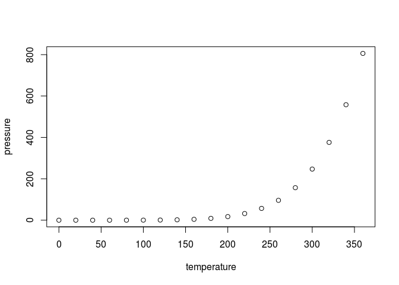

-   [Intro to Data Visualization with R for Data Journalists](#intro-to-data-visualization-with-r-for-data-journalists)
-   [Including Plots](#including-plots)
-   [Building Interactive Graphics](#building-interactive-graphics)

Intro to Data Visualization with R for Data Journalists
-------------------------------------------------------

This is an R Markdown document. Markdown is a simple formatting syntax for authoring HTML, PDF, and MS Word documents. For more details on using R Markdown see <http://rmarkdown.rstudio.com>.

When you click the **Knit** button a document will be generated that includes both content as well as the output of any embedded R code chunks within the document. You can embed an R code chunk like this:

``` r
summary(cars)
```

    ##      speed           dist       
    ##  Min.   : 4.0   Min.   :  2.00  
    ##  1st Qu.:12.0   1st Qu.: 26.00  
    ##  Median :15.0   Median : 36.00  
    ##  Mean   :15.4   Mean   : 42.98  
    ##  3rd Qu.:19.0   3rd Qu.: 56.00  
    ##  Max.   :25.0   Max.   :120.00

Including Plots
---------------

You can also embed plots, for example:

<!-- -->

Note that the `echo = FALSE` parameter was added to the code chunk to prevent printing of the R code that generated the plot.

``` r
library(ggplot2)
ggplot(data = iris, aes(x = Sepal.Length, y = Sepal.Width)) + 
  geom_point()
```

<!-- -->

Building Interactive Graphics
-----------------------------

``` r
library(plotly)
```

    ## Loading required package: ggplot2

    ## 
    ## Attaching package: 'plotly'

    ## The following object is masked from 'package:ggplot2':
    ## 
    ##     last_plot

    ## The following object is masked from 'package:graphics':
    ## 
    ##     layout

``` r
p <- ggplot(data = iris, aes(x = Sepal.Length, y = Sepal.Width)) + 
  geom_point()
ggplotly(p)
```

<!--html_preserve-->

<script type="application/json" data-for="htmlwidget-7399">{"x":{"data":[{"x":[5.1,4.9,4.7,4.6,5,5.4,4.6,5,4.4,4.9,5.4,4.8,4.8,4.3,5.8,5.7,5.4,5.1,5.7,5.1,5.4,5.1,4.6,5.1,4.8,5,5,5.2,5.2,4.7,4.8,5.4,5.2,5.5,4.9,5,5.5,4.9,4.4,5.1,5,4.5,4.4,5,5.1,4.8,5.1,4.6,5.3,5,7,6.4,6.9,5.5,6.5,5.7,6.3,4.9,6.6,5.2,5,5.9,6,6.1,5.6,6.7,5.6,5.8,6.2,5.6,5.9,6.1,6.3,6.1,6.4,6.6,6.8,6.7,6,5.7,5.5,5.5,5.8,6,5.4,6,6.7,6.3,5.6,5.5,5.5,6.1,5.8,5,5.6,5.7,5.7,6.2,5.1,5.7,6.3,5.8,7.1,6.3,6.5,7.6,4.9,7.3,6.7,7.2,6.5,6.4,6.8,5.7,5.8,6.4,6.5,7.7,7.7,6,6.9,5.6,7.7,6.3,6.7,7.2,6.2,6.1,6.4,7.2,7.4,7.9,6.4,6.3,6.1,7.7,6.3,6.4,6,6.9,6.7,6.9,5.8,6.8,6.7,6.7,6.3,6.5,6.2,5.9],"y":[3.5,3,3.2,3.1,3.6,3.9,3.4,3.4,2.9,3.1,3.7,3.4,3,3,4,4.4,3.9,3.5,3.8,3.8,3.4,3.7,3.6,3.3,3.4,3,3.4,3.5,3.4,3.2,3.1,3.4,4.1,4.2,3.1,3.2,3.5,3.6,3,3.4,3.5,2.3,3.2,3.5,3.8,3,3.8,3.2,3.7,3.3,3.2,3.2,3.1,2.3,2.8,2.8,3.3,2.4,2.9,2.7,2,3,2.2,2.9,2.9,3.1,3,2.7,2.2,2.5,3.2,2.8,2.5,2.8,2.9,3,2.8,3,2.9,2.6,2.4,2.4,2.7,2.7,3,3.4,3.1,2.3,3,2.5,2.6,3,2.6,2.3,2.7,3,2.9,2.9,2.5,2.8,3.3,2.7,3,2.9,3,3,2.5,2.9,2.5,3.6,3.2,2.7,3,2.5,2.8,3.2,3,3.8,2.6,2.2,3.2,2.8,2.8,2.7,3.3,3.2,2.8,3,2.8,3,2.8,3.8,2.8,2.8,2.6,3,3.4,3.1,3,3.1,3.1,3.1,2.7,3.2,3.3,3,2.5,3,3.4,3],"name":null,"text":[],"type":"scatter","mode":"markers","marker":{"opacity":null,"color":"rgb(0,0,0)","size":5.66929133858268,"symbol":"circle"},"xaxis":"x1","yaxis":"y1","showlegend":false}],"layout":{"xaxis":{"tickcolor":"rgb(51,51,51)","gridcolor":"rgb(255,255,255)","showgrid":true,"ticks":"outside","showticklabels":true,"type":"linear","title":"Sepal.Length","zeroline":false,"showline":false},"yaxis":{"tickcolor":"rgb(51,51,51)","gridcolor":"rgb(255,255,255)","showgrid":true,"ticks":"outside","showticklabels":true,"type":"linear","title":"Sepal.Width","zeroline":false,"showline":false},"plot_bgcolor":"rgb(235,235,235)","margin":{"b":40,"l":60,"t":25,"r":10},"legend":{"bordercolor":"transparent","x":1.01,"y":0.4875,"xref":"paper","yref":"paper","xanchor":"left","yanchor":"top","font":{"family":""},"bgcolor":"rgb(255,255,255)"},"showlegend":false,"titlefont":{"family":""},"paper_bgcolor":"rgb(255,255,255)"},"world_readable":true},"evals":[]}</script>
<!--/html_preserve-->
