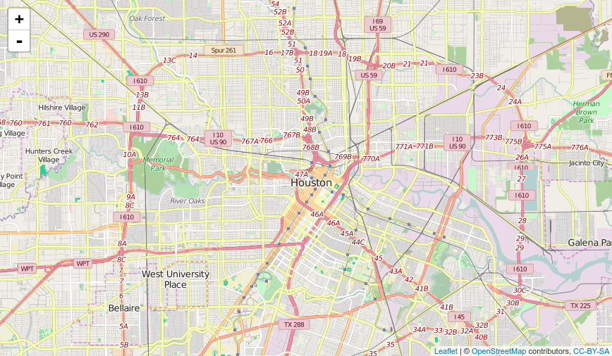
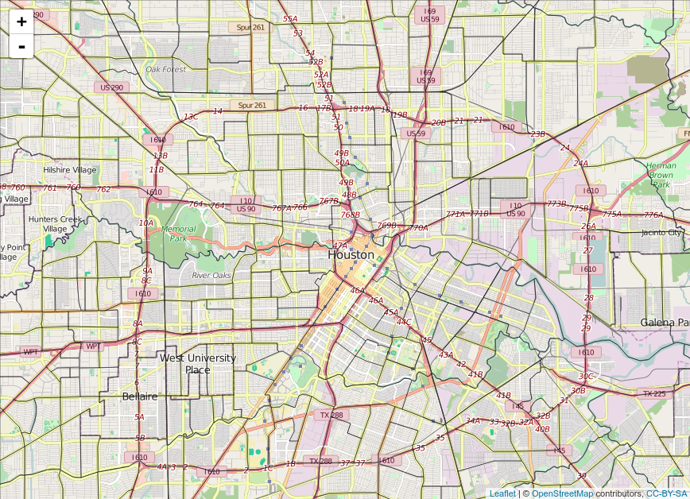
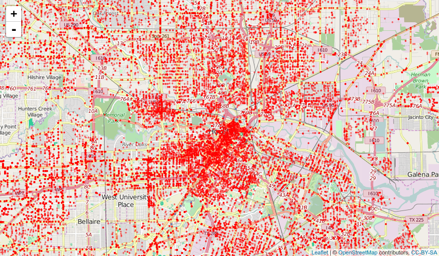

```{r setup, include=FALSE}
knitr::opts_chunk$set(cache=TRUE)
```

# Applied Spatial Data Science with R

## Introduction
I recently started working on my Ph.D dissertation which utilizes a vast amount of different spatial data types. During the process, I discovered that there were alot of concepts about using R for spatial data analysis that I was not aware of. The purpose of this report is to document some of those concepts and my favorite packages for spatial data analysis. This report is orgainized as follows: Firstly we need to ask why R is a good tool of choice for spatial analysis; secondly we shall go through a typical data analysis life-cycle from getting spatial data to data preparation, exploration, visualization and geostatistical analysis.

### Why use R for Spatial Data Analysis
You might be asking yourself; why use R for spatial analysis when there are commercial and open source Geographical Information Systems (GIS) like ESRI ArcMap and QGIS respectively. These are some of my reasons:

* R is free and open source
* Reproducibility: Researchers can reproduce their own analyses or other people's analyses and verify their findings
* Packages: There are a vast number of R packages for spatial data analysis, statistical modeling, visualisation, machine learning and more.

#### R Packages for Spatial Data Analysis
Some of my favorite packages for spatial data analysis include:

* [sp](https://cran.r-project.org/web/packages/sp/index.html): This package provides classes and methods for spatial data; utility functions for plotting maps, working with coordinates, etc.
* [rgdal](https://cran.r-project.org/web/packages/rgdal/index.html): This package provides methods for working with importing and exporting different raster and vector geospatial data formats; Coordinate Reference Systems; projections, etc.
* [rgeos](https://cran.r-project.org/web/packages/rgeos/index.html): Provides functions for handling operations on topologies.
* [ggplot2](http://ggplot2.org/): The most popular package for data visualisation by [Hadely Wickham](http://had.co.nz/)
* [ggmap](https://cran.r-project.org/web/packages/ggmap/index.html): Provides functions to visualize spatial data ontop of static maps from sources like Google Maps, Open Steet Maps, cloudmade and stamen.
* [leaflet](http://rstudio.github.io/leaflet/): Leaflet for R provides functions to control and integrate Leaflet, a JavaScript library for interactive maps, within R.
* [lubridate](https://cran.r-project.org/web/packages/lubridate/index.html): Most of my spatial data have Date-Time measurements. This package provides functions for manipulating dates and times.


## Data Preparation

### The Data
In this tutorial we shall use crime data from the [Houston Police Department](http://www.houstontx.gov/police/cs/stats2.htm) collected over the period of January 2010 - August 2010. [David Kahle](https://sites.google.com/site/davidkahle/ggmap), creator of the **ggmap** package, was kind enough to collect the data process it and make available through his package.

So let's install some of my favorite packages that we shall use in this tutorial.

```{r install_packages}
## These are some of my favorite packages for spatial data analysis
suppressPackageStartupMessages(library(ggmap))
suppressPackageStartupMessages(library(sp))
suppressPackageStartupMessages(library(rgdal))
suppressPackageStartupMessages(library(rgeos))
suppressPackageStartupMessages(library(ggplot2))
suppressPackageStartupMessages(library(leaflet))
suppressPackageStartupMessages(library(dplyr))
suppressPackageStartupMessages(library(magrittr))
suppressPackageStartupMessages(library(readr))
suppressPackageStartupMessages(library(lubridate))
suppressPackageStartupMessages(library(RColorBrewer))
suppressPackageStartupMessages(library(classInt))
```

### Reading Spatial Data

The crime data is in a comma separated value (CSV) format and small in size, only 13MB. It is available in this github respository: [https://github.com/SparkIQ-Labs/Demos/tree/master/spatial-analysis/data](https://github.com/SparkIQ-Labs/Demos/tree/master/spatial-analysis/data). 

**Note**: This full data is also available in the **ggmap** package as the data set "crime". You can load it into your R environment using the command `data(crime)`.

```{r read_data}
crime_df <- read_csv("data/crime.csv")

## We need to understand the structure of this dataset
str(crime_df)
```
A quick look at the data structure reveals that it is a data frame with 86,314 observations and 17 variables.  

Let's take a quick look at some of data records and some summary statistics to get familiar with our data. This can be done using the `head()` and `summary()` commands.
```{r quick_look}
head(crime_df, n = 5)
summary(crime_df)
```
The summary statistics reveal that we need to change the format of the variables "date", "offense", "month" and "day" to Date and Factors. We also need to get rid of the 5 data records with NAs in the "coordinates" variable as this will affect some of our spatial analyses.

```{r format_variables}
## Because the sp pacakge is not able to find an inherited method 
## for function ‘coordinates’ for signature ‘"tbl_df", let's convert our local dataframe.
## The variables "offense", "month", "day" should be factors
crime_df <- data.frame(crime_df) %>% filter(lon != "NA")
crime_df$offense <- as.factor(crime_df$offense)
crime_df$month <- as.factor(crime_df$month)
crime_df$day <- as.factor(crime_df$day)
crime_df$date <- as.Date(crime_df$date)
```

### Spatial Points Dataframe
In order to leverage the classes and methods in the several spatial packages, including the **sp** package, we need to convert the *"crime_df"* local dataframe into **"SpatialPointsDataFrame"**.
```{r SpatialPointsDataFrame}
## Convert to SpatialPointsDataFrame with longitude and latitude so as to use spatial packages
## The Cordinate Reference System is a Geographic CRS called WGS84
coords <- SpatialPoints(crime_df[, c("lon", "lat")])
crime_spatial_df <- SpatialPointsDataFrame(coords, crime_df)
proj4string(crime_spatial_df) <- CRS("+proj=longlat +ellps=WGS84")
```

Notice that we used some new functions namely SpatialPoints, SpatialPointsDataFrame, CRS and proj4string. These come from the **sp** package for spatial analysis. The foundation class from this package is **Spatial** from which other sub classes are generated including the following:
```{r sp_classes}
getClass("Spatial")
```

We can see that **SpatialPoints** and **SpatialPointsDataFrame** are subclass of the **Spatial** class. This kind of class system moves away from R's foundation class system to richer representations for working with spatial data types.

Now let's take a look at the structure of this new data type.
```{r structure_spdf}
str(crime_spatial_df)
```
You can see that the class is **SpatialPointsDataFrame** with 5 slots/components including:

1. **data**: The origin data that was read into R,
2. **coords.nrs**: The data type of the coordinates
3. **coords**: These are the coordinates
4. **bbox**: This is the bounding box of the coordinates, and 
5. **proj4string**: This is the Coordinate Reference System.  

We used the function `CRS()` to assign a Cordinate Reference System, in this case **WGS84**. We know that this is a **GEOGRAPHIC** Coordinate Reference System (CRS) type since the coordinates are in longitute and latitude format.

Alternatively you could use the `coordinates()` command as follows.
```{r coordinates_method}
# Or using the "coordinates" method
crime_spatial_df1 <- crime_df
coordinates(crime_spatial_df1) <- c("lon", "lat")
proj4string(crime_spatial_df1) <- CRS("+proj=longlat +ellps=WGS84")
```

#### Cordinate Reference Systems

It's important to understand Coordinate Reference Systems (CRS). These are very helpful in geocoding data in space. There are two types of CRS namely:  

1. Geographic Coordinate System (longitude, latitude) e.g WGS84
2. Cartesian/Projected/Planar Coordinate System (x, y)

The Projected Coordinate Reference System consists of several systems categorized into two main classes, namely:

1. State Plane (NADS 83): This is mostly used in the United States e.g Nevada State Plane NADS83.
2. Universal Transverse Mercator (UTM) e.g Nevada (UTM Zone 11N), South Africa (UTM Zones 34S & 35S)

If you see coordinate data that is in the following format, then it's in a Geographic Coordinate Systems.

1. (-94.324, 42.234)
2. (33.33 44.4), (33d19'47"N 44d23.9'E), (38SMB4488), (38n 444000 3688000)

Datums: Datums are sets of parameters and ground control points defining local coordinate systems. Examples: WGS84, NADS83

We now have a spatial points data frame with the right coordinate system and time data. We should probably save a copy of this as an R data file.
```{r write_data1}
## So we can quickly read in our processed data without having to re-process it.
saveRDS(crime_spatial_df, "data/crime_spatial_df.rds")
```

Alternatively we can save our processed data as ESRI shapefiles so as to maintain the spatial integretity, and also if you need to use with other GIS systems. The **rgdal** package provides ` writeOGR()` command for writing out spatial data types.
```{r write_shapefile}
## Also create a shapefile of this data
writeOGR(crime_spatial_df, dsn = "data/shapefiles", layer = "crime-shapefile", driver = "ESRI Shapefile", overwrite_layer = TRUE)
```

##### ESRI Shapefile Polygon
Another data set that we shall use are administrative census tracts for the Housston area. These data are available as polygon shapefiles from [the US Census website](http://www.census.gov/cgi-bin/geo/shapefiles/index.php).

```{r read_shapefile}
## Create a SpatialPolygonsDataFrame by reading in shapefile data
unzip("data/shapefiles/tl_2015_48_tract.zip", exdir = "data/shapefiles", overwrite = TRUE)
texas_shp <- readOGR(dsn = "data/shapefiles", layer = "tl_2015_48_tract")
class(texas_shp)
```

Alternatively we could use the `readShapeSpatial()` function from the **maptools** package to read shapefile data.
```{r}
texas_shp2 <- readShapeSpatial("data/shapefiles/tl_2015_48_tract.shp", proj4string = CRS("+proj=longlat +datum=WGS84"))
```

Our shapefile is of the class **"SpatialPolygonsDataFrame"**. We can take quick look at by plotting in using the `plot()` function.
```{r quick_plot}
## Use plot method to plot it
plot(texas_shp)
```

## Data Exploration
Some foundation methods in R can be used to explore spatial objects like `plot()`, `summary()`, `print()`, etc. For example `summary()` gives the number of spatial entities, the projection information, and the bounding box, and `print()` displays a view of the data in the spatial object. 

The **sp** package provides richer methods for manipulating spatial objects. 

A method for exploring the bounding area of any spatial object is the `bbox()` method. The first row reports the west–east range and the second the south–north direction.
```{r bounding_box}
bbox(crime_spatial_df)
```

We can explore the projection system of any spatial object using the `proj4string()` method. This method can also be used to assign a different coordinate system to a spatial object if need be. This can be done as follows:
```{r proj4string_method}
proj4string(crime_spatial_df)
```

We can explore/extract the individual slots in our spatial points data frame by using the "@" symbol instead of the "$" symbol. For example, let's look at the data and coordinate slots:
```{r data_slot}
# Explore the SpatialPointsDataFrame
head(crime_spatial_df@data)
head(crime_spatial_df@coords, 4)
```

```{r downtown_only}
# Restrict the data to downtown only
downtown_crime <- subset(crime_df, 
                         -95.39681 <= lon & lon <= -95.34188 &
                          29.73631 <= lat & lat <= 29.78400)
```

## Data Visualisation

R has several packages for visualizing spatial data. We shall look at tradition plotting systems in R that come with an R installation, commonly named "base-R" packages. An example is the `plot()` function for spatial data in the **sp** package. We shall also explore "external" packages for doing including ggplot2, ggmap, and leaflet. 

### Visualizing the Data Using Traditional Plot System

The **sp* package provides functions for plotting spatial data by adding layers incrementally. Let's start by plotting the shapefiles of Houston Texas.
```{r plot_polygon}
plot(texas_shp, col = "grey", axes = TRUE)
```

Then let's add crime data onto the map. Use the argument `add = TRUE` to add another layer onto the plot.
```{r add_points}
plot(texas_shp, col = "grey", axes = TRUE)
plot(crime_spatial_df, pch = 21, bg = "red", cex = .5, add = TRUE)
```

Then add a title and a legend.
```{r add_title_legend}
plot(texas_shp, col = "grey", axes = TRUE)
plot(crime_spatial_df, pch = 21, bg = "red", cex = .5, add = TRUE)
title("Locations of Offensive Crimes in Houston, Texas")
legend("topleft", title = "Legend", legend = "Crime Locations", pch = 21, pt.bg = "red", bty = "n")
```

While the base functions for plotting spatial data are sufficient enough to produce maps, we would love to explore "external" R libraries that provide more capabilities and produce beautiful maps like ggplot2, ggmap, leaflet.

### Visializing the Data Using External Libraries

#### ggplot2
ggplot2 works with data frames and not objects of class **Spatial***. So we have to convert them using the `fortify()` function from ggplot2.
```{r fortify}
crime_df <- data.frame(crime_spatial_df)
texas_shp_df <- fortify(texas_shp)
```

Now we can leverage **ggplot2's** powerful plotting capabilities.
```{r ggplot_option}
p <- ggplot() + 
  geom_polygon(data = texas_shp_df, aes(x=long, y=lat, group = group)) + coord_equal() +
  geom_point(data = crime_df, aes(x = lon, y = lat, color = "red")) +
  labs(title = "Locations of Offensive Crimes in Houston, Texas") +
  xlab("Longitude") + 
  ylab("Latitude")

p
```

#### ggmap

Create the static background layer for the city of Houston, Texas
```{r BackgroundLayer, echo = TRUE, cache = TRUE}
## Use "get_map" command to download the images and format them for plotting
map_dat <- get_map(location = "houston", source = "osm", zoom = 14)
```

Use "ggmap" command to make the plot
```{r}
houstonMap <- ggmap(map_dat, extent = "device", legend = "topleft")
houstonMap
```

Plot the shapefiles
```{r add_shapefiles}
houstonMap2 <- houstonMap + 
  geom_polygon(aes(x = long, y = lat, group = group), data = texas_shp_df, colour = "black", 
               alpha = .4, size = .3)

houstonMap2
```

Geocode the downtown crime data using longitute and latitute variables
```{r add_points_to_map}
houstonMap3 <- houstonMap2 + 
  geom_point(aes(x = lon, y = lat), data = downtown_crime, alpha = 0.5, color="darkred", size = 3)

houstonMap3
```

#### Leaflet
Leaflet for R is a package that provides functions to develop elegant and beautiful Leaflet maps. [Leaflet](http://leafletjs.com/) is the leading open-source JavaScript library for interactive maps.

Let's first start by creating a map of the the houston area and then adding layers (features). This can be done using the `leaflet()` command. The first layer that we should add are the "Tiles" using the `addTiles` command.
```{r map_widget, eval = FALSE}
m <- leaflet() %>% setView(lng = -95.3698028, lat = 29.7604267, zoom = 12) %>% addTiles()
m
```



Then add the shapefile data onto the map. This is added as another layer, polygon, using the `addPolygon` command.
```{r leaflet_add_shapefiles, eval = FALSE}
m1 <- m %>% addPolygons(data = texas_shp, fillColor = "transparent", color = "black", weight = 1)
m1
```


Finally add the crime data onto the map. This is added as another layer, points, using the `addMarkers` command.
```{r leaflet_add_points, eval = FALSE}
m2 <- m %>% addCircles(data = crime_spatial_df, weight = 1.5, color = "red")
m2
```


## Geostatistical Analysis
In the next blog post, we shall see how to perform geostatistical analysis on spatial data. 

## References
For further reading, refer to the following references.  

1. [Applied Spatial Data Analysis with R](http://www.asdar-book.org/). Roger S. Bivand, Edzer Pebesma and V. Gómez-Rubio. UseR! Series, Springer. 2nd ed. 2013, xviii+405 pp., Softcover. ISBN: 978-1-4614-7617-7
2. [ggmap: Spatial Visualization with ggplot2](https://cran.r-project.org/web/packages/ggmap/ggmap.pdf)
3. [Do more with dates and times in R with lubridate 1.3.0](https://cran.r-project.org/web/packages/lubridate/vignettes/lubridate.html)
4. [Introduction to visualising spatial data in R](https://github.com/Robinlovelace/Creating-maps-in-R). Robin Lovelace (R.Lovelace@leeds.ac.uk), James Cheshire, Rachel Oldroyd and others V. 1.3, September 2015
5. [Leaflet for R](http://rstudio.github.io/leaflet/basemaps.html)
6. [gglot2 documentation](http://docs.ggplot2.org/current/index.html)
7. [Introduction to dplyr](https://cran.rstudio.com/web/packages/dplyr/vignettes/introduction.html)