-   [Types of spatial data](#types-of-spatial-data)
-   [Handling spatial data](#handling-spatial-data)
    -   [Projections](#projections)
-   [Example 1: Reading data from shapefiles](#example-1-reading-data-from-shapefiles)
    -   [ggplot2 mapping](#ggplot2-mapping)
-   [Example 2: Merging attribute data from two sources](#example-2-merging-attribute-data-from-two-sources)
-   [Example 3: Spatial joins and clipping](#example-3-spatial-joins-and-clipping)
-   [More spatial aggregation](#more-spatial-aggregation)
-   [Fun with rgeos](#fun-with-rgeos)
-   [Maps with ggplot2](#maps-with-ggplot2)
    -   [Example 4: 2014 Unemployment in France by department](#example-4-2014-unemployment-in-france-by-department)
        -   [Faceting choropleths over time](#faceting-choropleths-over-time)
    -   [Example 5: California cities](#example-5-california-cities)
    -   [Example 6: USArrests data](#example-6-usarrests-data)
-   [Mapping with raster images](#mapping-with-raster-images)
-   [Coda](#coda)
-   [References](#references)

This document is concerned with generating and visualizing spatial data in R, with emphasis on `ggplot2` and a few packages that use `ggplot2` as the graphical engine. Spatial data arises in a number of formats, so we will look at a few ways to convert spatial data into a form with which `ggplot2` can work. We begin by considering various types of spatial data.

Types of spatial data
---------------------

Spatial data are data with spatial references; i.e., known geographical locations with respect to some reference point that serves as an origin. A common origin is the Prime Meridian at Greenwich, England for longitude (E-W) and the Equator for latitude (N-S). The World Geodetic System (WGS84) expresses a geographical location in terms of degrees east or west from the Prime Meridian and degrees north or south of the Equator and serves as a common reference system for spatial locations on the surface of the Earth.

The world is an oblate spheroid, but it is usually necessary to represent spatial locations on a two-dimensional map. This entails some type of projection from \(R^3 \rightarrow R^2\). Several such projections have been developed by cartographers and spatial analysts; when a map is printed, it is a representation of both a spatial coordinate reference system (CRS) and a particular type of projection.

There are four general types of spatial information (Wickham, 2016):

-   vector boundaries
-   raster images
-   point metadata
-   area metadata

Vector boundaries and raster images provide different ways of representing geographical regions. Vector boundaries are data files that contain information about the geographical coordinates of (administrative) boundaries within a geographical region. In other words, they provide the raw material for drawing the outlines of geographical boundaries. Conversely, raster images are digitized maps of a geographical region which fall into several categories---e.g., topographical maps, road maps or satellite maps.

Metadata, also referred to as attribute data, refers to values of variables computed with respect to some geographic area of interest. Point metadata refers to values at point locations, such as city population, whereas area metadata refers to (aggregated) values over a specific geographic area, such as total cancer incidence by county.

Metadata is typically collected into data tables with spatial identifiers, which could be (long, lat) pairs, cities, counties or countries. Raster data can be obtained from several sources and be held in several different formats; ditto for vector boundaries.

Data regarding spatial boundaries are often held in *shapefiles*. Several formats of shapefiles exist: two common types are ESRI and EPSG. We can use the spatial packages in R to convert interchangeably from one format to another. Shapefiles can be downloaded from various web sites around the world; for US states, additional options are the `USAboundaries` package and the `tigris` package on Github, the latter of which is connected to Census data.

Raster images are digital maps from providers such as Google, MapQuest or OpenStreetMap. The `osmar` package connects to OSM, the `plotKML` package works with maps from Google Earth and `ggmap` downloads maps from several sources. Generally speaking, these files provide a background layer for plotting spatial metadata, either as point processes or as areal data. To do so, it is typically necessary to merge the metadata of interest with the map data before it can be passed to R for mapping.

Handling spatial data
---------------------

As noted above, spatial data are data tied to spatial locations, so each spatial data set requires a binding to spatial coordinates, usually in 2D, but occasionally in 1D or 3D. Moreover, the spatial coordinates are tied to a reference coordinate system, often in conjunction with some type of map projection. The characteristic of spatial data is that attributes are typically correlated as a function of spatial distance. For example, in areal data, it is usually the case that adjacent areas are more closely related with respect to some characteristic than those further away.

The standard workflow of a geoscientist working with spatial data is as follows (Rossiter, 2010):

1.  Prepare spatial data in a GIS or image processing program.
2.  Import the data into R.
3.  Perform the analysis and display the results using R graphics.
4.  Export the results back to the GIS/image processing software.
5.  Use the results for further GIS analysis or include them in a map layout.

Three R packages interface with GISs: `rgdal`, `maptools` and `rgeos`. The `rgdal` package provides an interface to the Geospatial Data Abstraction Library (GDAL), which is tied to the export of GIS files. The `maptools` package is designed to interface with external spatial data structures such as shapefiles. It is fairly limited in terms of the types of files it handles (primarily ESRI shapefiles and ASCII grids), so has largely been superceded by `rgdal`. Due to certain licensing restrictions on the use of certain functions in `rgdal`, `rgeos` was developed as an open-source alternative.

The importance of `rgdal` is its interface with GDAL, an open-source translator library for (geo)spatial data formats (Rossiter, 2010). More specifically, `rgdal` plays nice with the spatial classes defined in the `sp` package. Its primary purpose is to read or write files between GDAL grid maps and spatial objects in R, or to read/write spatial vector data using OGR, a C++ open-source library that reads a wide variety of vector file formats, including ESRI shapefiles and other formats output by popular GIS programs.

The `sp` package is the conduit between external spatial data and R. It is an S4 package that provides a uniform set of R spatial data objects that can be used with any spatial statistics package in R. The data structures supported in `sp` are:

-   points (e.g., `SpatialPoints`, `SpatialPointsDataFrame`)
-   lines (e.g., `SpatialLines`, `SpatialLinesDataFrame`)
-   polygons (e.g., `SpatialPolygons`, `SpatialPolygonsDataFrame`)
-   grids (e.g., `SpatialGrid`, `SpatialGridDataFrame`)
-   pixels (e.g., `SpatialPixels`, `SpatialPixelsDataFrame`)
-   multipoints (e.g., `SpatialMultiPoints`, `SpatialMultiPointsDataFrame`)

Each of these may contain attribute data in a separate slot, and methods for the standard generic functions (e.g., `summary()`, `plot()`, `print()`) are defined to elicit appropriate behavior in each class of spatial object.

### Projections

In spatial data, location coordinates are just numbers. This is OK if the spatial data has no connection to the Earth's surface, e.g., for locations on microchip wafers or images from a microscope, but for geographic analysis, the coordinates must be related to the Earth's surface. The `sp` package uses the Coordinate Reference System (CRS) from the `rgdal` package and marries it with the cartographic projection library `proj.4` from the USGS in order to produce meaningful spatial locations. There are a variety of projection methods, so it is important that the geometry data and the attribute data are consistent in terms of CRS and projection.

The `rgdal::CRS()` function handles the details of this process. For example, to completely specify the datum, ellipsoid, projection and coordinate system of the Dutch Rijksdriehoek system (RDH) on the `meuse` data frame from the `gstat` package, we would write:

    proj4string(meuse) <- CRS("+proj=stere
         +lat_0=52.15616055555555 +lon_0=5.38763888888889
         +k=0.999908 +x_0=155000 +y_0=463000
         +ellps=bessel +units=m +no_defs
         +towgs84=585.2369,50.0087,465.658,
           -0.406857330322398,0.350732676542563,-1.8793473836068,
           4.0812")

Since most systems are included in the European Petroleum Survey Group (EPSG) database, it is sufficient to find its number in that database (<http://www.espg.org>) and use it:

    proj4string(meuse) <- CRS("+init=epsg:28992")

To change a coordinate reference system, we simply replace it using `proj4string()`. This is illustrated in Example 1 below.

Example 1: Reading data from shapefiles
---------------------------------------

There are several ways of reading data from shapefiles. The following example comes from the GeoTALISMAN short course notes by James Cheshire and Robin Lovelace, concerning the prevalence of participation in sporting activities in London. Shapefiles come in a bundle; they typically consist of files with the following extensions: `.dbf`, `.sbn`, `.sbx`, `.shp`, `.shx`. The `rgdal` function `readOGR()` processes these files and returns an S4 spatial data object of class `SpatialPolygonsDataFrame`.

``` r
sport <- readOGR(dsn = "data", layer = "london_sport")
```

    OGR data source with driver: ESRI Shapefile 
    Source: "data", layer: "london_sport"
    with 33 features
    It has 4 fields

The `dsn` argument refers to a subdirectory of the current working directory, while the `layer` argument refers to the name associated with the relevant set of shapefiles. More specifically, it accesses the files `london_sport.shp`, `london_sport.dbf`, `london_sport.sbn`, etc.

As an S4 object, the information in `sport` is held in *slots*, accessed by `@`. Slots are somewhat analogous to list components. The metadata in a `SpatialPolygonsDataFrame` (SPDF) are held in its `data` slot; the other slots contain information about the geometry of the spatial object.

``` r
head(sport@data, n = 2)
```

      ons_label                 name Partic_Per Pop_2001
    0      00AF              Bromley       21.7   295535
    1      00BD Richmond upon Thames       26.6   172330

``` r
# Note that the slot is a data frame
str(sport@data)
```

    'data.frame':   33 obs. of  4 variables:
     $ ons_label : Factor w/ 33 levels "00AA","00AB",..: 6 27 17 16 21 29 18 24 32 8 ...
     $ name      : Factor w/ 33 levels "Barking and Dagenham",..: 5 27 17 16 21 29 18 24 32 8 ...
     $ Partic_Per: num  21.7 26.6 21.5 17.9 24.4 19.3 16.9 20.7 26 17.6 ...
     $ Pop_2001  : int  295535 172330 243006 224262 147271 179767 212352 187919 260379 330584 ...

``` r
# Generate a summary of the object
summary(sport)
```

    Object of class SpatialPolygonsDataFrame
    Coordinates:
           min      max
    x 503571.2 561941.1
    y 155850.8 200932.5
    Is projected: TRUE 
    proj4string :
    [+proj=tmerc +lat_0=49 +lon_0=-2 +k=0.9996012717 +x_0=400000
    +y_0=-100000 +ellps=airy +units=m +no_defs]
    Data attributes:
       ons_label                    name      Partic_Per       Pop_2001     
     00AA   : 1   Barking and Dagenham: 1   Min.   : 9.10   Min.   :  7181  
     00AB   : 1   Barnet              : 1   1st Qu.:17.60   1st Qu.:181284  
     00AC   : 1   Bexley              : 1   Median :19.40   Median :216505  
     00AD   : 1   Brent               : 1   Mean   :20.05   Mean   :217335  
     00AE   : 1   Bromley             : 1   3rd Qu.:21.70   3rd Qu.:248917  
     00AF   : 1   Camden              : 1   Max.   :28.40   Max.   :330584  
     (Other):27   (Other)             :27                                   

The summary tells us that the object `sport` is a `SpatialPolygonsDataFrame`. Moreover, there is some information about the CRS: we see that the object is projected, which means it is a Cartesian reference system. It also appears that the projection is Mercator.

Before doing any plotting, we can change the coordinate reference system by redefining `proj4string()`. The coordinate system to the British National Grid is `epsg:27700`:

``` r
proj4string(sport) <- CRS("+init=epsg:27700")
```

    Warning in `proj4string<-`(`*tmp*`, value = <S4 object of class structure("CRS", package = "sp")>): A new CRS was assigned to an object with an existing CRS:
    +proj=tmerc +lat_0=49 +lon_0=-2 +k=0.9996012717 +x_0=400000 +y_0=-100000 +ellps=airy +units=m +no_defs
    without reprojecting.
    For reprojection, use function spTransform in package rgdal

The warning states that the CRS is being changed, but the data are not being reprojected. To do that, you need to use `spTransform`. For example, to change the CRS to `WGS84`, one would use

``` r
sport.wgs84 <- spTransform(sport, CRS("+init=epsg:4326"))
summary(sport.wgs84)
```

    Object of class SpatialPolygonsDataFrame
    Coordinates:
             min        max
    x -0.5103395  0.3338729
    y 51.2867601 51.6918477
    Is projected: FALSE 
    proj4string :
    [+init=epsg:4326 +proj=longlat +datum=WGS84 +no_defs +ellps=WGS84
    +towgs84=0,0,0]
    Data attributes:
       ons_label                    name      Partic_Per       Pop_2001     
     00AA   : 1   Barking and Dagenham: 1   Min.   : 9.10   Min.   :  7181  
     00AB   : 1   Barnet              : 1   1st Qu.:17.60   1st Qu.:181284  
     00AC   : 1   Bexley              : 1   Median :19.40   Median :216505  
     00AD   : 1   Brent               : 1   Mean   :20.05   Mean   :217335  
     00AE   : 1   Bromley             : 1   3rd Qu.:21.70   3rd Qu.:248917  
     00AF   : 1   Camden              : 1   Max.   :28.40   Max.   :330584  
     (Other):27   (Other)             :27                                   

Note that not only is the CRS changed to `WGS84`, but the object `sport.wgs84` is not projected since the `+proj` argument was not applied.

The geometry data can be plotted with the `plot()` method associated with S4 spatial objects:

``` r
plot(sport)
```

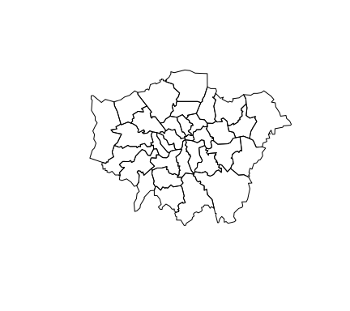<!-- -->

Adding some metadata to the plot is fairly simple:

``` r
plot(sport)
plot(sport[sport$Partic_Per > 25, ], col = "blue", add = TRUE)
```

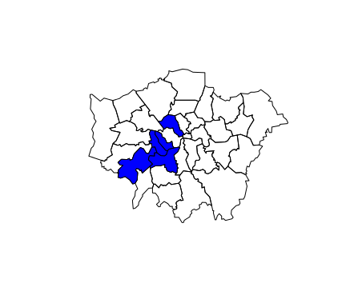<!-- -->

This shows the boroughs of London where participation in sports is over 25%. However, it is important to observe that the metadata is not bound to the geometry data. In this example, the mapping was rendered in base graphics. However, it is more common in R to use the `lattice` and `ggplot2` packages for mapping spatial data. Moreover, there exist additional CRAN packages for more specific sets of spatial mapping applications, a few of which will be considered later in this document.

### ggplot2 mapping

Two aspects of the above plot are worth noting: (i) the input data is an object of class `SpatialPolygonsDataFrame`; (ii) the plot was rendered in base graphics, which you can tell by the syntax. (The argument `add = TRUE` is a giveaway.) `ggplot2` can only plot data frames, so in order to use it to plot these data, we need to convert the object `sport` into a data frame. We do this through a `fortify()` function in `ggplot2` specifically designed for spatial objects.

Before showing how to do this, we note that since `sport@data` is a data frame, it can be used directly for plotting in `ggplot2`, but observe that the geometry data is not present in this slot. This can be useful if we want to graph variables in `sport@data` without consideration of spatial location. We need `fortify()` to convert the geometry data to a data frame and then merge it with the attribute data to return a suitable data frame from which `ggplot2` can produce maps. To actually produce a map in `ggplot2`, either the `maptools` or `rgeos` package must be pre-loaded.

``` r
sport.f <- fortify(sport, region = "ons_label")
str(sport.f)
```

    'data.frame':   1102 obs. of  7 variables:
     $ long : num  531027 531555 532136 532946 533411 ...
     $ lat  : num  181611 181659 182198 181895 182038 ...
     $ order: int  1 2 3 4 5 6 7 8 9 10 ...
     $ hole : logi  FALSE FALSE FALSE FALSE FALSE FALSE ...
     $ piece: Factor w/ 1 level "1": 1 1 1 1 1 1 1 1 1 1 ...
     $ id   : chr  "00AA" "00AA" "00AA" "00AA" ...
     $ group: Factor w/ 33 levels "00AA.1","00AB.1",..: 1 1 1 1 1 1 1 1 1 1 ...

In this call, `ons_label` identifies boroughs; it is a variable in `sport@data`. We can see from the output of `str()` that the result is indeed a data frame. However, the attribute information is lost in the process, so we need to get it back through a merge operation.

``` r
sport.f <- merge(sport.f, sport@data, by.x = "id", by.y = "ons_label")
str(sport.f)
```

    'data.frame':   1102 obs. of  10 variables:
     $ id        : chr  "00AA" "00AA" "00AA" "00AA" ...
     $ long      : num  531027 531555 532136 532946 533411 ...
     $ lat       : num  181611 181659 182198 181895 182038 ...
     $ order     : int  1 2 3 4 5 6 7 8 9 10 ...
     $ hole      : logi  FALSE FALSE FALSE FALSE FALSE FALSE ...
     $ piece     : Factor w/ 1 level "1": 1 1 1 1 1 1 1 1 1 1 ...
     $ group     : Factor w/ 33 levels "00AA.1","00AB.1",..: 1 1 1 1 1 1 1 1 1 1 ...
     $ name      : Factor w/ 33 levels "Barking and Dagenham",..: 7 7 7 7 7 7 7 7 7 7 ...
     $ Partic_Per: num  9.1 9.1 9.1 9.1 9.1 9.1 9.1 9.1 9.1 9.1 ...
     $ Pop_2001  : int  7181 7181 7181 7181 7181 7181 7181 7181 7181 7181 ...

This recovers the attribute data, so we are now ready to use this data frame for plotting maps in `ggplot2`. The following code plots sport participation by borough using a greyscale gradient:

``` r
Map <- ggplot(sport.f, 
              aes(long, lat, group = group, fill = Partic_Per)) +
          theme_dark() +
          geom_polygon(color = "black") +
          coord_equal() +
          labs(x = "Easting (m)", y = "Northing (m)",
               fill = "% Sport Partic.") +
          ggtitle("London Sports Participation") +
          theme(panel.background = element_rect(fill = "grey10"))
Map + scale_fill_gradient(low = "grey30", high = "white")
```

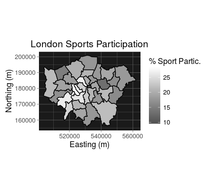<!-- -->

This is a version of a choropleth map. Adding the argument `color = "black"` to `geom_polygon()` produces black outlines of borough boundaries. Since we are plotting the map in greyscale, it's useful to create a dark panel background to make the gradations in greyscale pop out a bit more.

Example 2: Merging attribute data from two sources
--------------------------------------------------

This example will also use the London shapefile, but will use a different set of attribute data. The code below uses the `readOGR()` function from `rgdal` to read in the shapefile, as before, but we will save the result to a different name.

``` r
lnd <- readOGR(dsn = "data", layer = "london_sport")
```

    OGR data source with driver: ESRI Shapefile 
    Source: "data", layer: "london_sport"
    with 33 features
    It has 4 fields

The attribute data associated with `lnd` contains information about sport participation and 2001 population. The objective in this section is to merge it with a related source of crime data.

``` r
crimeDat <- read.csv("data/mps-recordedcrime-borough.csv",
                     fileEncoding = "UCS-2LE")
head(crimeDat, 3)
```

       Month                   MajorText              MinorText CrimeCount
    1 201104 Violence Against The Person         Common Assault         81
    2 201104                    Burglary Burglary In A Dwelling         78
    3 201104   Other Notifiable Offences       Other Notifiable         12
        Spatial_DistrictName
    1 Kensington and Chelsea
    2 Kensington and Chelsea
    3 Kensington and Chelsea

Our first step is to aggregate the number of Theft and Handling crimes over boroughs. The GeoTALISMAN short course notes show how to do this with base package code, but it is clearer to do this with `dplyr` and the result is the same (except for data class).

``` r
crimeAgg <- crimeDat %>% 
            filter(MajorText == "Theft & Handling") %>%
            group_by(Spatial_DistrictName) %>%
            summarise(CrimeCount = sum(CrimeCount))
```

The 25th row of `CrimeAgg` has a NULL district name, so we want to replace it with the non-matching level from `lnd@data`. To do that, we separate out the levels vector, make the replacement and then overwrite it in `crimeAgg`.

``` r
u <- crimeAgg$Spatial_DistrictName
u[which(u == "NULL")] <- setdiff(lnd@data$name, u)
crimeAgg$name <- u    # change to match name in lnd@data
```

We created a new variable `name` in `crimeAgg` to match the equivalent variable in `lnd@data`, which makes the column `Spatial_DistrictName` obsolete, so we remove it in the code to follow. We now have two ways to go in terms of merging `crimeAgg` with `lnd`: one is to merge the two objects together as is, in which case the result is a `SpatialPolygonsDataFrame`; the other is to merge `lnd@data` with `crimeAgg` in order to return a data frame.

``` r
# return a SpatialPolygonsDataFrame
lndCrime <- merge(lnd, crimeAgg[, -1],  by = "name")
class(lndCrime)
```

    [1] "SpatialPolygonsDataFrame"
    attr(,"package")
    [1] "sp"

To merge the data into a separate object, we do the following:

``` r
londonCrime <- lnd@data %>% inner_join(crimeAgg[, -1])
str(londonCrime)
```

    'data.frame':   32 obs. of  5 variables:
     $ ons_label : Factor w/ 33 levels "00AA","00AB",..: 6 27 17 16 21 29 18 24 32 8 ...
     $ name      : chr  "Bromley" "Richmond upon Thames" "Hillingdon" "Havering" ...
     $ Partic_Per: num  21.7 26.6 21.5 17.9 24.4 19.3 16.9 20.7 26 17.6 ...
     $ Pop_2001  : int  295535 172330 243006 224262 147271 179767 212352 187919 260379 330584 ...
     $ CrimeCount: int  15172 9715 15302 12611 9023 8810 17319 10508 22898 21259 ...

Apart from the ordering of the columns, `londonCrime` and `lndCrime@data` are equivalent.

Example 3: Spatial joins and clipping
-------------------------------------

It is reasonably common to have spatial data that apply to a broader geographical area than is required in a given problem, so it is of some interest to learn how to apply clipping to a visualization so that only the regions of interest have data. In this example from the geoTALISMAN tutorial, we limit a data frame of transportation infrastructure points (stations) to the city limits of London. The station data is read in as follows:

``` r
# read in the lnd-stns shapefile
stations <- readOGR(dsn = "data", layer = "lnd-stns")
```

    OGR data source with driver: ESRI Shapefile 
    Source: "data", layer: "lnd-stns"
    with 2532 features
    It has 27 fields

``` r
# check the projection with that of lnd
proj4string(stations)
```

    [1] "+proj=longlat +datum=WGS84 +no_defs +ellps=WGS84 +towgs84=0,0,0"

``` r
proj4string(lnd)
```

    [1] "+proj=tmerc +lat_0=49 +lon_0=-2 +k=0.9996012717 +x_0=400000 +y_0=-100000 +ellps=airy +units=m +no_defs"

``` r
# compare the respective bounding boxes
bbox(stations)
```

                    min        max
    coords.x1 -1.199066  0.9358515
    coords.x2 50.984598 51.9398978

``` r
bbox(lnd)
```

           min      max
    x 503571.2 561941.1
    y 155850.8 200932.5

Firstly, the CRS of `stations` differs from that of `lnd`; secondly, the bounding boxes are widely different. This means we need to do some work to make the coordinate systems correspond. We choose to reproject the `stations` shapefile to make it correspond with `lnd` and then plot the results.

``` r
stations <- spTransform(stations, CRSobj = CRS(proj4string(lnd)))
plot(lnd)
points(stations)
```

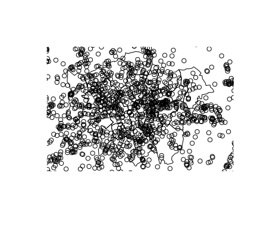<!-- -->

We can see that the `stations` data go well beyond the London city limits and into the suburbs, so we need to clip it, which is quite easy to do:

``` r
stations_lnd <- stations[lnd, ]
plot(lnd)
points(stations_lnd, cex = 0.6)
```

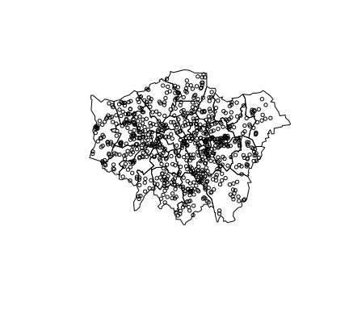<!-- -->

The subsetting that produces `stations_lnd` works because it is using the function `sp::over()` in the background. The less concise version is

    sel <- over(stations, lnd)
    stations_lnd <- stations[!is.na(sel[, 1]), ]

The first argument to `over()` is the target layer (the one to be clipped) and the second is the source (or reference) layer. The result object `sel` is a data frame of the same dimension as the target layer except that the points which fall out of the region of interest defined by the second layer are set to NA in the first column (`coordinates`). The second line of code simply subsets those stations with non-missing coordinates.

More spatial aggregation
------------------------

While `dplyr` can perform spatial aggregation on a data frame that contains spatial information, it cannot do so on a spatial *object*. For that purpose, there is a method for `aggregate` from the base distribution that works. In the code below, we count the number of stations in each borough, but since borough information is not included in `stations`, we can access both `stations` and `lnd` in the same call:

``` r
stations.c <- aggregate(x = stations["CODE"], by = lnd, FUN = length)
class(stations.c)
```

    [1] "SpatialPolygonsDataFrame"
    attr(,"package")
    [1] "sp"

Observe that the `by` variable, `lnd`, is used to identify the borough in which each station is located. We then count the number of stations in each borough. One option is to extend `lnd` by adding a new list component; to do this,

``` r
names(stations.c@data)
```

    [1] "CODE"

``` r
lnd$NPoints <- stations.c$CODE   # add new component to lnd
```

The above example shows how to combine two `SpatialPolygonsDataFrame` objects and produce aggregate measures of some kind by borough.

Next, let's consider how to take summary results, discretize their values into a few select intervals and produce a choropleth map of the result. To do this, we return to the aggregated crime data.

``` r
# Categorize crime counts into intervals
q <- findInterval(lndCrime@data$CrimeCount, 
                  c(0, 10000, 20000, 30000, 80000))
# Matching colors to unique values of q
cols <- c("yellow2", "cornsilk", "orange", "skyblue")
# Add q to data frame
lndCrime@data$crimeCat <- factor(q, labels = c("< 10000", "10K-20K",
                                               "20K-30K", "> 30000"))
# Generate a choropleth plot
plot(lndCrime, col = cols[q])
# Produce a legend
legend(legend = levels(lndCrime@data$crimeCat), fill = cols, "topright")
```

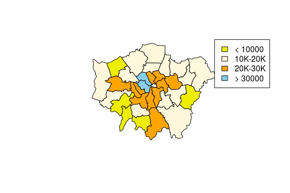<!-- -->

The two high-crime boroughs are in the central part of the city, with one of them having over twice the theft incidence of the other.

We can add information to this map concerning the location of train stations and tube (subway) stations within greater London. This is done by using the `stations` data again, subsetting the stations within London and making separate symbols to distinguish the two types. This is done through regular expressions on the station description in the variable `LEGEND`; we want to select A Roads and Rapid Transit stations.

``` r
levels(stations$LEGEND)
```

    [1] "Railway Station"                           
    [2] "Rapid Transit Station"                     
    [3] "Roundabout, A Road Dual Carriageway"       
    [4] "Roundabout, A Road Single Carriageway"     
    [5] "Roundabout, B Road Dual Carriageway"       
    [6] "Roundabout, B Road Single Carriageway"     
    [7] "Roundabout, Minor Road over 4 metres wide" 
    [8] "Roundabout, Primary Route Dual Carriageway"
    [9] "Roundabout, Primary Route Single C'way"    

``` r
stations_lnd <- stations[lnd, ]
sel <- grepl("A Road|Rapid", stations_lnd$LEGEND)
sym <- 2 + grepl("Rapid", droplevels(stations_lnd$LEGEND[sel]))
plot(lnd)
points(stations_lnd[sel, ], pch = sym, cex = 0.8)
legend(legend = c("A Road", "RTS"), "bottomright", pch = unique(sym))
```

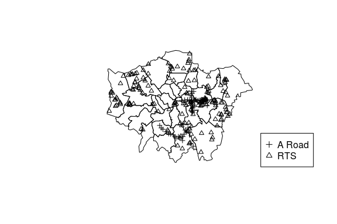<!-- -->

Fun with rgeos
--------------

Some of the tasks performed above can also be done with the `rgeos` package. The function `rgeos::gIntersects()` can be used to clip spatial data: it takes two SPDFs as its first two arguments and creates a logical vector or matrix to indicate which points are common between them. The following example from the geoTALISMAN tutorial illustrates a basic use case.

``` r
# library(rgeos)

# intersect the stations and lnd spatial polygons data frames
int <- gIntersects(stations, lnd, byid = TRUE)
b.indices <- which(int, arr.ind = TRUE)
summary(b.indices)
```

          row             col        
     Min.   : 1.00   Min.   :  91.0  
     1st Qu.: 8.00   1st Qu.: 446.5  
     Median :15.00   Median : 636.0  
     Mean   :15.01   Mean   : 946.3  
     3rd Qu.:22.00   3rd Qu.:1370.5  
     Max.   :33.00   Max.   :2496.0  

``` r
b.names <- lnd$name[b.indices[, 1]]
b.count <- aggregate(b.indices ~ b.names, FUN = length)
head(b.count)
```

                   b.names row col
    1 Barking and Dagenham  12  12
    2               Barnet  31  31
    3               Bexley  28  28
    4                Brent  30  30
    5              Bromley  48  48
    6               Camden  14  14

The original `stations` data has 2352 rows while the `lnd@data` data frame has 33, one row per borough. The object `int` is a logical matrix of size 33 \(\times\) 2352 that indicates, for each borough, whether a station is or is not located within it. The matrix `b.indices` has one row per station located inside greater London whose first coordinate is its borough. The atomic vector `b.names` is a factor of length 731 that contains the borough name of each row of `b.indices`, and equivalently, of `stations_lnd`. Finally, the vector `b.count` contains the number of stations in each borough.

To plot the locations of the stations within borough Barking and Dagenham, we first need to plot just the borough and then its points within borough.

``` r
plot(lnd[grepl("Barking", lnd$name), ])
points(stations_lnd[which(b.names == "Barking and Dagenham"), ])
```

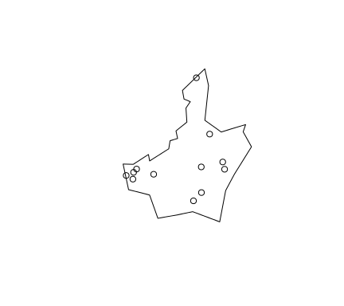<!-- -->

Finally, we can plot the number of stations in each borough with a choropleth as follows.

``` r
q <- findInterval(b.count$row, seq(0, 50, by = 10))
qv <- q[lnd@data$name]
cols <- c("cornsilk", "orange", "skyblue", "royalblue", "navy")
plot(lnd, col = cols[qv])
rngs <- c("0-10", "11-20", "21-30", "31-40", "41-50")
legend(legend = rngs, fill = cols, "topright")
```

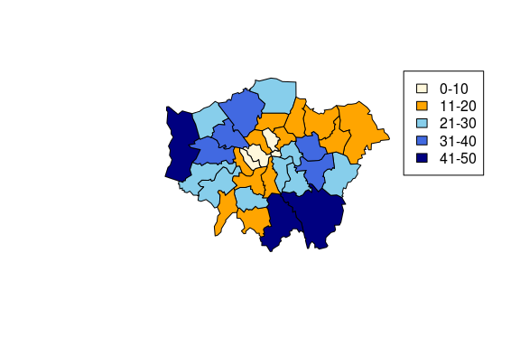<!-- -->

Maps with ggplot2
-----------------

Most of the S4 spatial packages (e.g., `spdep`, `sp`, `raster`) use the `lattice` package for graphics since they were originally developed before `ggplot2` came into existence. There are several ways to plot maps with `ggplot2`, along with a few mapping packages that use `ggplot2`, such as `ggmap` and `choroplethr`.

The key thing to remember when mapping with `ggplot2` is that it always expects a data frame as input. Thus, if you are working with spatial data objects from `sp`, primarily those of the form `SpatialxxxDataFrame`, you first need to convert them to data frames before passing them to `ggplot2`. Fortunately, `ggplot2` has a generic function `fortify()` that converts data from one format to another. There are built-in methods for spatial data frames (`fortify.sp()`) and linear model objects (`fortify.lm()`); the `ggfortify` package has several more.

The following example is fairly elaborate, but it illustrates some of the issues that arise in graphing spatial data.

### Example 4: 2014 Unemployment in France by department

The goal is to map unemployment rates in France by department for 2014. These are the required steps:

-   Get the data at the department level
-   Get a shapefile map for France at the department level
-   Convert the shapefile to a data frame for `ggplot2`
-   Create another data frame that allows one to annotate departments with their unemployment rate
-   Generate the graphic with `ggplot2`

This sounds easier than it is, but certain pieces are fairly simple once you know where to find them.

One can get administrative maps at various levels for almost any country from `gadm.org`. One of its compelling features, from our perspective, is the option of downloading a map as an R `SpatialPolygonsDataFrame` object saved in an `.rds` file (the recommended form of an R binary file). This is *very* convenient, as we'll see below. To download the map,

1.  Go to `gadm.org` and click on the "Download" tab.
2.  Select "France" as the country and from the dropdown menu, select "R (SpatialPolygonsDataFrame)" as the file format. Then click OK.
3.  Underneath the map, select "level1". The file should then start to download to your default downloads directory. It should have the name `FRA_adm1.rds`. (Level 1 districts in France are departments, of which there are 22.)

To get the set of shapefiles, one would select "Shapefiles" as the file format and a zip file that contains the various shapefiles would be downloaded. This would work with the methods described in the previous section. Another option is to select "Google Earth .kmz", which can be used in conjunction with the `plotKML` package for raster images with extensions `.kml` or `kmz`.

Next, we need to get unemployment data at the department level. After a bit of searching, I found a table of unemployment rates at Eurostat. However, Eurostat reports for all countries belonging to the European Union, so we have to extract the data we want from the downloaded Excel file. I manually created an Excel workbook for France alone with department name as the first column, with succeeding columns representing unemployment rates by department from 2003-2014.

It should now be simple to merge this data into the `SpatialPolygonsDataFrame` (SPDF) object. Keeping the France data in an Excel workbook retains the original name formatting, and we can use the `readExcel` package to get the data into R.

Starting with the downloaded SPDF from <http://gadm.org> and the edited Excel workbook, both saved in the same R project directory, we start coding with the two input files as follows.

``` r
# Read in the SPDF for France (level 1 districting)
france1 <- readRDS("FRA_adm1.rds")

# Data set of 2014 unemployment rates by department in France
# Data is gleaned from an Excel file downloaded from Eurostat
library(readxl)
france_unemp <- read_excel("France_unemployment.xlsx", na = ":")
```

We reconcile the three minor name mismatches between the two objects in the unemployment data:

``` r
france_unemp$Dept[c(1, 5, 8)] <- france1$NAME_1[c(4, 8, 17)]
# Restrict to the 2014 data
unemp14 <- france_unemp[, c("Dept", "Y2014")]
names(unemp14)[2] <- "unemp"
```

This will enable safe merging of attribute data with geometry data. Just to make sure we get a map at the department level, we convert the SPDF to a data frame and then create the map in `ggplot2`.

``` r
france2 <- fortify(france1, region = "NAME_1")

# Basic country map
ggplot(france2, aes(x = long, y = lat, group = group)) +
  geom_polygon(fill = "orange", color = "black") +
  coord_quickmap()
```

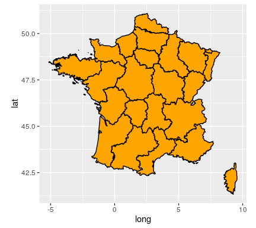<!-- -->

Note that `coord_quickmap()` was introduced in `ggplot2-1.1.0` and provides a quick-and-dirty way to set a reasonable aspect ratio for long-lat coordinates. Another option is to use `coord_equal()`, which ensures the same long-lat units in each direction.

This map does not contain the unemployment data. We want to do two things:

-   map the fill color aesthetic to the unemployment rate variable;
-   annotate each department with its unemployment rate value.

To fulfill the first goal, we need to merge the unemployment data into the fortified SPDF. For the second goal, we create a separate annotation data frame that contains the centroid longitude and latitude values of each department, its name and the unemployment rate. That data frame will be used in the `geom_text()` layer.

Recall that a SPDF contains both geometry data (the borders) and metadata in the `@data` slot. The `fortify()` function only converts the geometry data; therefore, we have to merge metadata into the fortified data frame.

``` r
# Merge france_unemp14 data with france2
france_adm1 <- merge(france2, unemp14, by.x = "id",
                     by.y = "Dept", all.x = TRUE)
```

The department names (the common variable) are named differently in the two data objects: `id` in `france2`, `Dept` in `unemp14`. We inform `merge()` about this through the `by.*` arguments. To merge `france_unemp14` into the much larger `france2`, we perform a left join, which is signified by `all.x = TRUE`.

The annotation data frame is produced as follows:

``` r
# get long-lat centroids of each department along with names,
# since france1@data and france_unemp have department names in
# different orders.
france_centroids <- data.frame(as.data.frame(coordinates(france1)),
                               id = france1@data$NAME_1)
names(france_centroids)[c(1, 2)] <- c("long", "lat")
# merge with france_unemp14
france14 <- merge(france_centroids, unemp14, 
                  by.x = "id", by.y = "Dept")
```

We are now in a position to generate the choropleth map.

``` r
ggplot(france_adm1, aes(x = long, y = lat)) + 
    theme_dark() +
    geom_polygon(aes(fill = unemp, group = group), color = "black") +
    geom_text(data = france14,
              aes(x = long, y = lat, label = unemp), 
              size = 3) +
    coord_equal() +
    scale_fill_gradient(low = "orangered", high = "yellow") +
    labs(x = "Longitude", y = "Latitude", fill = "Rate (%) ") 
```

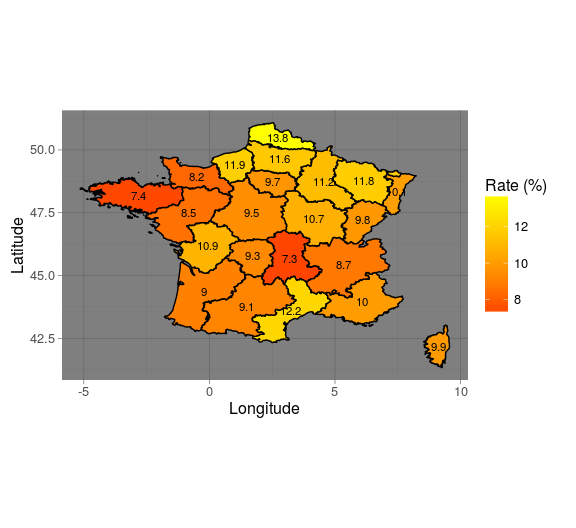<!-- -->

The separate annotation data frame reduces execution time by a considerable margin.

If we replace the unemployment rate annotation with department names, we run into a problem of overlapping names. The `ggrepel` package provides a way out:

``` r
library(ggrepel)
ggplot(france_adm1, aes(x = long, y = lat)) + 
    theme_dark() +
    geom_polygon(aes(fill = unemp, group = group), color = "black") +
    geom_text_repel(data = france14,
              aes(x = long, y = lat, label = id), 
              size = 3) +
    coord_equal() +
    scale_fill_gradient(low = "orangered", high = "yellow") +
    labs(x = "Longitude", y = "Latitude", fill = "Rate (%) ") 
```

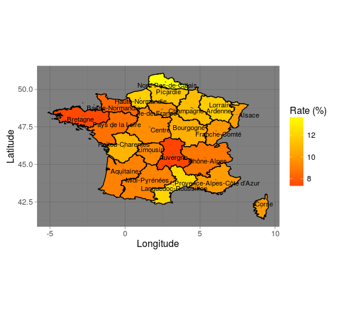<!-- -->

The function `geom_text_repel()` applies a text separation algorithm that tries to disentangle overlapping text as best it can. It does a pretty decent job in this case, but it would be less successful if the text size were increased.

#### Faceting choropleths over time

The data frame `france_unemp` actually contains unemployment rates by department from 2003--2014, so it is not particularly difficult to generate faceted choropleths of unemployment rates.

``` r
library(tidyr)
# Melt the years data
france_unemp_melt <- france_unemp %>% 
                     gather(yr, rate, -Dept) %>%
                     separate(yr, c("y", "year"), 1) %>%
                     select(-y)
# Merge with the fortified SPDF - this takes a while
france_adm2 <- merge(france2, france_unemp_melt, by.x = "id",
                     by.y = "Dept", all.x = TRUE)

# Faceted choropleth plots - labels are omitted...too small
ggplot(france_adm2, aes(x = long, y = lat)) + 
    theme_dark() +
    geom_polygon(aes(fill = rate, group = group), color = "black") +
    coord_equal() +
    scale_fill_gradient(low = "orangered", high = "yellow") +
    labs(x = "Longitude", y = "Latitude", fill = "Rate (%) ") +
    facet_wrap(~ year)
```

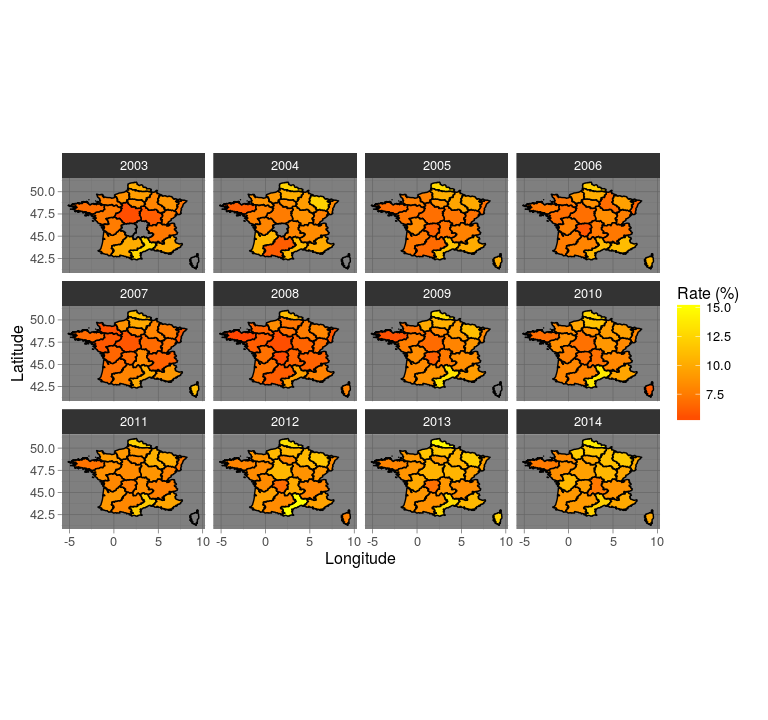<!-- -->

This plot shows a gradual nationwide increase in unemployment since the financial crisis struck in 2008, despite the fact that France resisted the austerity measures imposed by the Central European Bank that caused unemployment to soar in other countries. When a department has the same color as the background, it means the unemployment rate is missing for that year. Most of the missing data is in 2003 and 2004, but the unemployment rate is also missing for Corsica (Corse) in 2009 and 2011.

### Example 5: California cities

The next example applies some point metadata on city populations to the state of California map. This is a variation on an example in the forthcoming edition of the `ggplot2` book.

The game plan is as follows:

-   Get vector boundaries for California counties.
-   Get point metadata about population for California cities.
-   Plot them together in `ggplot2`.

This is a comparatively easy task because all of the information can be found in existing R packages. We get the vector boundaries data from the `maps` package through the following `ggplot2` function:

``` r
ca_counties <- map_data("county", "california") %>%
               select(lon = long, lat, group, id = subregion)
head(ca_counties)
```

            lon      lat group      id
    1 -121.4785 37.48290     1 alameda
    2 -121.5129 37.48290     1 alameda
    3 -121.8853 37.48290     1 alameda
    4 -121.8968 37.46571     1 alameda
    5 -121.9254 37.45998     1 alameda
    6 -121.9483 37.47717     1 alameda

We can plot it as follows:

``` r
ggplot(ca_counties, aes(x = lon, y = lat)) +
    theme_dark() +
    geom_polygon(aes(group = group), 
                 fill = "orange", color = "black") +
    coord_quickmap() +
    theme(panel.background = element_rect(fill = "gray20"))
```

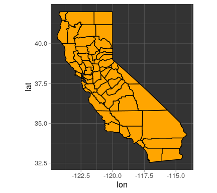<!-- -->

The last line just sets a slightly darker fill color than the default for `theme_dark()`. Next, let's extract some (obsolete) data for California cities with population over 200,000.

``` r
ca_cities <- maps::us.cities %>%
             tbl_df() %>%
             filter(country.etc == "CA") %>%
             select(-country.etc, lon = long) %>%
             arrange(desc(pop)) %>%
             filter(pop > 200000)
```

Next, plot the locations of these cities with a bubble plot whose point area is proportional to population.

``` r
ggplot(ca_cities, aes(x = lon, y = lat)) +
  theme_dark() +
  geom_polygon(data = ca_counties, aes(group = group),
               fill = "blue", color = "black") +
  geom_point(aes(size = pop), color = "yellow3") +
  scale_size_area() + 
  coord_quickmap() 
```

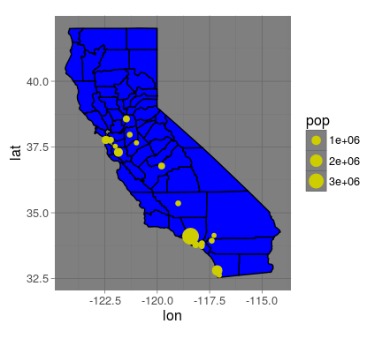<!-- -->

Fortunately, several sources exist for getting vector boundaries data at the state and county level. We have already seen two ways to get state level boundaries: from `gadm.org` and from the `maps` package. Another source is the `choroplethr` package and its companion, `choroplethrMaps`. We have also cited the `tigris` package on Github and the CRAN package `USAboundaries`.

Typically, the types of data we would want to represent in a choropleth are summaries of demographic, economic or political data at the state or county level.

### Example 6: USArrests data

Another useful `ggplot2` function is `geom_map()`, which takes a fortified spatial object as its input that must contain variables with names `x` or `long`, `y` or `lat` and `region` or `id`. The example below comes from the `geom_map()` help page, using the built-in `USArrests` data frame as the metadata for a choropleth map of the United States.

``` r
# Clean up the USArrests data and convert it to long form
crimes <- data.frame(state = tolower(rownames(USArrests)), USArrests)
crimesm <- reshape2::melt(crimes, id = 1)

# ggplot2::map_data() requires the maps package. It gets the
# state boundaries data in a form amenable to ggplot2.
require(maps)
states_map <- map_data("state")

# Plot murder rates by state. The map does
# not include Alaska and Hawaii, which are dropped silently.
ggplot(crimes, aes(map_id = state)) +
    geom_map(aes(fill = Murder), map = states_map) +
    expand_limits(x = states_map$long, y = states_map$lat)

# Change from the default coordinate system to coord_map();
# coord_equal() or coord_quickmap() are other options.
last_plot() + coord_map()
```

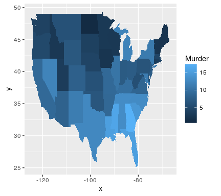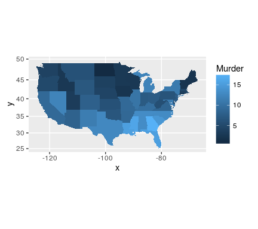

To plot choropleths for multiple crimes, we use the melted data in conjunction with `facet_wrap()`. The downside of this approach is that murder rates, for example, are much lower than assault rates. The fill scale colorbar covers the range of values over all faceted variables rather than individual variables, so we find in the plot below that the map for all crimes other than assault are essentially uninformative due to homogeneity in color.

``` r
ggplot(crimesm, aes(map_id = state)) +
    geom_map(aes(fill = value), map = states_map) +
    expand_limits(x = states_map$long, y = states_map$lat) +
    facet_wrap( ~ variable)
```

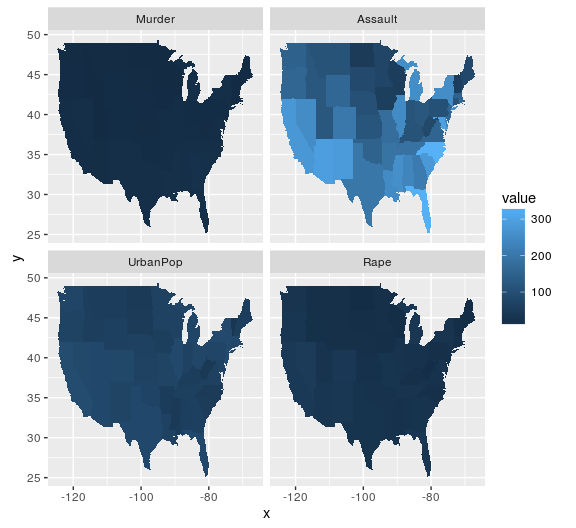<!-- -->

Mapping with raster images
--------------------------

Several packages use raster images as background for maps. The most popular of these is the `ggmap` package. Its primary documentation is a paper in the R Journal (Kahle and Wickham, 2012). Basically, a thematic map in `ggmap` is produced as follows:

-   For the geographic area of interest, use `get_map()` to get a raster image map from one of several sources.
-   Add graphics to the map using `ggplot2`. This requires an input data frame that contains coordinates of the spatial locations at which the data are to be plotted. If this is unavailable, one can use the `geocode()` function to get them from Google, under certain restrictions.

The following graph is a map of Las Vegas overlaid with some wind data.

``` r
# library(ggmap)

# read in the wind data
air <- read.csv("windvector.csv", stringsAsFactors=FALSE)
air$dir <- 2 * pi * air$wd/360  # convert from degrees to radians
str(air)
```

    'data.frame':   8 obs. of  8 variables:
     $ label: int  43 71 73 75 298 540 1019 2002
     $ site : chr  "PM" "WJ" "PV" "JO" ...
     $ lat  : num  36.1 36.2 36.2 36.3 36 ...
     $ lon  : num  -115 -115 -115 -115 -115 ...
     $ ws   : int  15 9 20 8 13 5 10 11
     $ wd   : int  90 270 180 185 112 10 189 45
     $ o3   : int  80 80 82 77 81 87 84 83
     $ dir  : num  1.57 4.71 3.14 3.23 1.95 ...

The original wind direction is in degrees, but we will be using `geom_spoke()`, which requires angles in radians. Next, we get a map of Las Vegas as follows.

``` r
map <- get_map(location = "Clark County, NV", zoom = 10, maptype = "roadmap")
class(map)
```

    [1] "ggmap"  "raster"

`ggmap::ggmap()` requires an object of class `ggmap` as input. One of its arguments allows darkening of the map so that the features in the plot appear more prominently. We plot wind vectors in this graph, whose angle reflects wind direction and whose length reflects wind speed. Color is mapped to \(O_3\) concentration, where higher \(O_3\) values get lighter colors. Since \(O_3\) is numeric, the guide is a colorbar. The plotted points represent the locations where the measurements were taken. The numbers in yellow are numeric codes for the locations.

``` r
ggmap(map, darken = 0.4) + 
      geom_point(aes(x=lon, y=lat, colour=o3), 
                 data=air, size=3) + 
      scale_colour_gradient(low = "orangered", high="yellow") + 
      geom_text(data = air, aes(x = lon, y = lat, label = label), 
                size = 3.5, nudge_x = 0.03, nudge_y = -0.02,
                angle=320, fontface=2, colour="yellow3") +
      geom_spoke(data = air, 
                 aes(x = lon, y = lat, angle=dir, 
                     radius=ws/100, colour = o3),
                 size = 1.5)
```

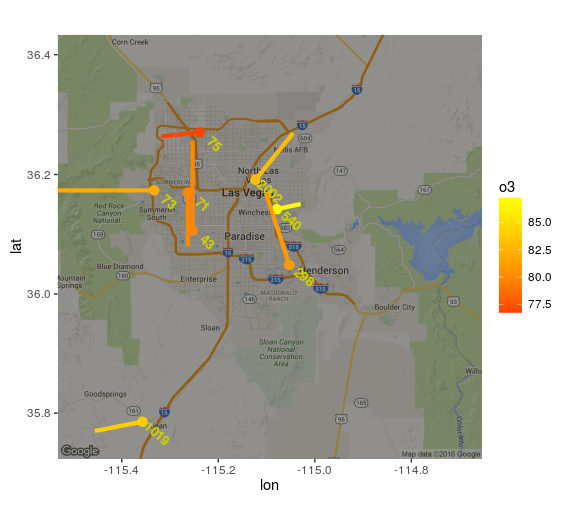<!-- -->

This example shows a rather typical use of `ggmap`: get a nice raster image background map and then superimpose a `ggplot` on top of it.

An example from the geoTALISMAN tutorial shows off some of the more advanced features of `ggmap`. Again, we map London and consider the sports participation data. Let's begin with the following data merge on the (fortified) WGS84 projected SPDF.

``` r
sport.wgs84.f <- fortify(sport.wgs84, region = "ons_label")
sport.wgs84.f <- merge(sport.wgs84.f, sport.wgs84@data, 
                       by.x = "id", by.y = "ons_label")
```

Next, we compute the bounding box of the SPDF and get a raster image of that region.

``` r
b <- bbox(sport.wgs84)

# Expand the extent of the bounding box
b[1, ] <- mean(b[1, ]) + 1.05 * (b[1, ] - mean(b[1, ]))
b[2, ] <- mean(b[2, ]) + 1.05 * (b[2, ] - mean(b[2, ]))

lnd_b1 <- get_map(location = b)

ggmap(lnd_b1) + 
    geom_polygon(data = sport.wgs84.f, 
                 aes(x = long, y = lat, group = group,
                     fill = Partic_Per),
                 alpha = 0.4) +
    scale_fill_gradient(low = "maroon", high = "yellow")
```

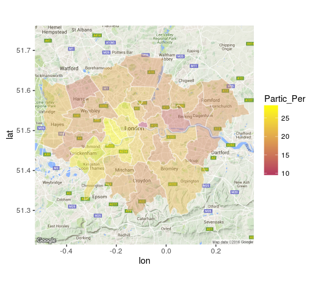<!-- -->

We can try a different base map and crop it to the City of London itself.

``` r
lnd_b2 <- get_map(location = b, source = "stamen", 
                  maptype = "toner", crop = TRUE)
ggmap(lnd_b2) + 
    geom_polygon(data = sport.wgs84.f, 
                 aes(x = long, y = lat, group = group,
                     fill = Partic_Per),
                 alpha = 0.5) +
    scale_fill_gradient(low = "blue", high = "yellow")
```

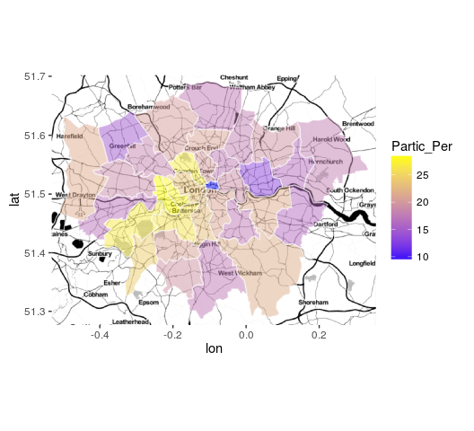<!-- -->

Coda
----

This document has pulled together some of the basic mapping features for spatial data in R. It is by no means a comprehensive tutorial on the subject, nor is it meant to suggest that R is a one-stop shop for spatial mapping. However, it is meant to give you a taste of the types of spatial maps you can create in R.

Fundamentally, geospatial maps are rooted in the `sp` package, which provides a common infrastructure for spatial data objects in R. For example, given an object of class `SpatialPolygonsDataFrame`, one can get the coordinates of the centroid of any polygon with `coordinates()` or the bounding box of the region of interest with `bbox()`; both of these functions are methods defined for objects created in the `sp` package. The fundamentals of `sp` are described in detail in Bivand, et al. (2013) as well as a description of various forms of spatial data and their handling. In addition, an excellent survey of R packages for various aspects of spatial visualization and analysis is the Spatial Task View at CRAN: <https://cran.r-project.org/web/views/Spatial.html>

Many spatial packages in R have been around for over a decade. At the time these were written, the most comprehensive graphics package was `lattice`, so many of these packages use lattice graphics rather than `ggplot2`. Until recently, `lattice` had two major advantages over `ggplot2` for package developers:

-   lattice graphics is usually faster, and sometimes much faster, than `ggplot2`;
-   it was easier to write functions in `lattice` for special-purpose graphics than it was in `ggplot2`.

Version 2 of `ggplot2` has made it easier for package developers to develop their own geoms and stats, so the landscape may be different beyond 2015 or 2016, but these are the primary reasons why `lattice` graphics is more widely used in spatially-oriented packages than `ggplot2`. Although we have not shown any examples of `lattice` in this document, you can find many examples in well-established packages such as `gstat`, `raster` and `spatstat`, particularly for visualization of geostatistical analyses, which have not been covered here.

More generally, a number of R packages exist for visualizing spatial data, including:

-   `choroplethr`, a package for producing choropleth maps for administrative regions using `ggplot2`, which contains several helper functions to access data from government databases;
-   `osmar`, a package that gets raster images from OpenStreetMap, as well as `OpenStreetMap`;
-   `plotKML`, a package that gets raster images from Google Earth in Keyhole Markup Language (KML) format and superimposes metadata on them in interesting ways;
-   `RGoogleMaps` and `plotGoogleMaps`, packages that download Google Maps for use in R.

`choroplethr` and `plotKML` both come with well-written vignettes, so we did not cover them here. OpenStreetMap and GoogleMaps are well-established data sources for raster image maps, so you can investigate them on your own.

A fairly recent, but very useful, package for creating thematic maps is `tmap`, which uses a `ggplot2`-like syntax. A thematic map is essentially a raster image map with metadata overlaid in some appropriate fashion. A choropleth is a special case of a thematic map for areal data, but one can overlay numeric data as well. Some examples include point process maps (e.g., California large cities from Example 5), global vegetation data (e.g., from Landsat or Lidar images) and weather data summarized from satellite images, such as vector fields for fluid movement of water or air, heat maps for temperature data, etc.

A recent trend in R graphics is to merge R graphics capabilities with related packages in JavaScript to produce interesting, interactive and reactive web graphics. The `leaflet` and `leafletR` packages connect R with the `leaflet.js` package in JavaScript to produce interactive spatial maps for the Web. An updated version of the geoTALISMAN tutorial, cited below, includes coverage of `leafletR` as well as `tmap`.

We have not covered the important topic of graphics for spatio-temporal data due to time and space limitations, but it is an area of growing interest and rapid development. Several R packages are devoted to space-time data---see the Spatial Task View referenced above for further details.

References
----------

All of the books referenced below are part of the useR! series published by Springer.

1.  Lovelace, R. and J. Cheshire (2015). *Introduction to visualizing spatial data in R.* (updated geoTALISMAN tutorial). <https://cran.r-project.org/doc/contrib/intro-spatial-rl.pdf>
2.  Rossiter, D. G. (2010). *Spatial Analysis with the R Project for Statistical Computing*. <http://www.css.cornell.edu/faculty/dgr2/teach/R/RSpatialIntro_ov.pdf>
3.  Bivand, R., E. Pebesma and V. Gomez-Rubio (2013). *Applied Spatial Data Analysis with R*, 2nd ed. New York: Springer. <http://www.asdar-book.org/>
4.  Perpinan Lamigueiro, O. (2013). *Displaying Time Series, Spatial and Space-Time Data with R*. New York: Springer. <http://oscarperpinan.github.io/spacetime-vis/>
5.  Kahle, D. and H. Wickham (2013). `ggmap`: Spatial visualization with `ggplot2`. *R Journal*, no. 1, pp. 144--161. <https://journal.r-project.org/archive/2013-1/kahle-wickham.pdf>
6.  Wickham, H. (2016). *ggplot2: Elegant graphics for data analysis*, 2nd ed (forthcoming). New York: Springer.
7.  Package vignettes for `choroplethr`, `tmap`, `plotKML`, accessible from their respective package help pages.
