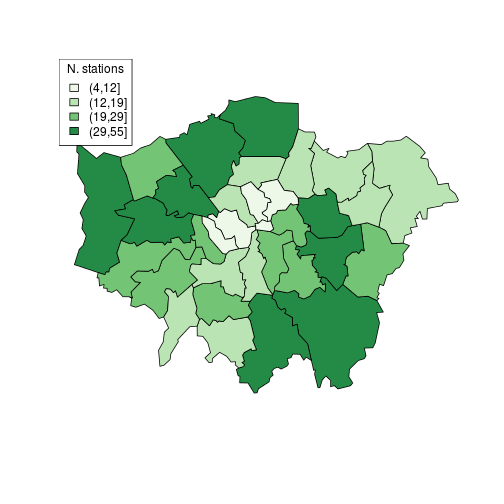

Choropleth maps using R's base graphics
========================================================

This example shows how to create a basic choropleth map in R
as an add-on to a tutorial on R for spatial data visualisation:
https://github.com/geocomPP/sdvwR

In this tutorial we focus on ggplot2 for making attractive visualisations. 
However, R's base graphics also allow for map creation and 
choropleth maps. 

As before, the first stage is to load the data.


```r
load("data/lndStC.RData")
```


There are many colour schemes available and they can be customised manually. 
This can be time consuming, however, so it is recommended to use a colour package
that can create colour schemes automatically. 
Load the package and see what are available:


```r
library(RColorBrewer)
brewer.pal.info
```

```
##          maxcolors category
## BrBG            11      div
## PiYG            11      div
## PRGn            11      div
## PuOr            11      div
## RdBu            11      div
## RdGy            11      div
## RdYlBu          11      div
## RdYlGn          11      div
## Spectral        11      div
## Accent           8     qual
## Dark2            8     qual
## Paired          12     qual
## Pastel1          9     qual
## Pastel2          8     qual
## Set1             9     qual
## Set2             8     qual
## Set3            12     qual
## Blues            9      seq
## BuGn             9      seq
## BuPu             9      seq
## GnBu             9      seq
## Greens           9      seq
## Greys            9      seq
## Oranges          9      seq
## OrRd             9      seq
## PuBu             9      seq
## PuBuGn           9      seq
## PuRd             9      seq
## Purples          9      seq
## RdPu             9      seq
## Reds             9      seq
## YlGn             9      seq
## YlGnBu           9      seq
## YlOrBr           9      seq
## YlOrRd           9      seq
```


Now we create the breaks and plot the result:


```r
cols <- brewer.pal(4, "Greens")
brks <- c(4, 12, 19, 29, 55)
cut(lndStC$NUMBER, brks)
```

```
## Loading required package: sp
```

```
##  [1] (29,55] (19,29] (29,55] (12,19] (4,12]  (4,12]  (19,29] (19,29]
##  [9] (4,12]  (29,55] (12,19] (12,19] (19,29] (29,55] (29,55] (12,19]
## [17] (29,55] (19,29] (19,29] (4,12]  (4,12]  (29,55] (4,12]  (12,19]
## [25] (29,55] (12,19] (12,19] (19,29] <NA>    (4,12]  (12,19] (19,29]
## [33] (4,12] 
## Levels: (4,12] (12,19] (19,29] (29,55]
```

```r
gs <- cols[findInterval(lndStC$NUMBER, vec = brks)]
# png(filename='figure/nStations.png', width = 600, height= 550) # add to
# save plot
plot(lndStC, col = gs)
legend("topleft", legend = levels(cut(lndStC$NUMBER, brks)), fill = cols, title = "N. stations")
```

 

```r
# dev.off() # used to stop the png graphics driver
```


